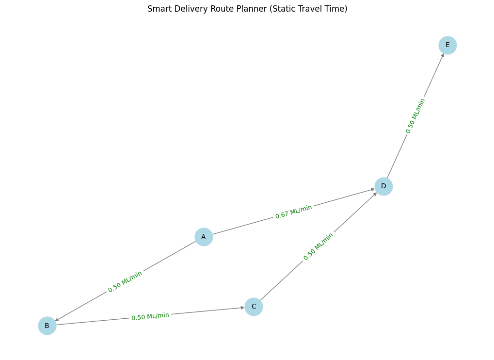

# 13.8-Project-3-Smart-Delivery-Route-PlannerJungNgSanders

## Group Members
Group Members: Michael Jung (ID:10680322), Timothy Sanders (ID: 01002147), Megan Ng (ID: 00756276)

# 🧠 Project Design & Structure
```
project_3/
├── main.py:
├           build_graph(filename)
├           is_route_possible(graph, start, end)
├           find_shortest_path(graph, start, end)
├           plan_delivery(graph, start, end)
├           visualize_graph(graph, plans)
├── graph_utils.py: Vertex class, Graph class, Edge class
├── traffic_simulation.py: adjust_for_traffic(graph, time_of_day),get_traffic_multiplier(level)
├── design_doc.pdf
├── sample_input.csv
├── README.md
└── DESIGN.md
```

# 📄 Overview
✅ Real-world purpose of the project

- In this lab, our team will design and develop a graph-based Smart Delivery Route Planner System to help a logistics company provide reliable and adaptive delivery services to its customers while optimizing its efficiency.
- The core goal of this system is to minimize delivery time and travel distance, thereby reducing fuel consumption, labor costs, and transportation delays—all of which contribute to a satisfying and cost-effective customer experience.
- The system begins by constructing a representative road network, modeling the city as a graph where delivery locations are vertices and roads are directed, weighted edges—with weights representing distance or estimated travel time. Upon receiving a delivery request, the system first validates the route's feasibility based on the current state of the road network and, if available, real-time traffic conditions.
- If the route is available, it applies graph algorithms such as Dijkstra’s algorithm to compute the shortest path between delivery points, and may use DFS or BFS to determine route connectivity. The system then generates an optimal delivery route that considers key factors such as distance, travel time, and delivery urgency.
- Furthermore, our planning system also can dynamically adapt delivery routes in real time to prioritize urgent shipments while still efficiently handling regular deliveries.

🧠 Limitation of project

Our current lab simulation simplifies traffic conditions by uniformly updating all routes at once. For example, all routes are designated as having heavy traffic in the morning and light traffic at night. This model does not well simulate the real-time application. To better align with real-world conditions, we must adopt a more sophisticated traffic model that differentiates routes either individually or by category.


✅ Input
sample_input.csv
```
from_vertex	to_vertex	distance	travel_time	traffic
A	        B	        5	        10	        moderate
B	        C	        3	        6	        light
C	        D	        4	        8	        heavy
D	        E	        2	        4	        high
A	        D	        10	        15	        low
```


✅ Traffic Adjustement Criteria
```
Traffic_level{
        "heavy": 1.5,
        "high": 1.25,
        "moderate": 1.0,
        "light": 0.8,
        "low": 0.75
    }.get((level or "moderate").lower(), 1.0)

time_to_traffic = {
        "morning": "heavy",
        "late_morning": "high",
        "afternoon": "moderate",
        "evening": "light",
        "night": "low"
    }
```

✅ Sample Output

## 📥 time_of_Day = "morning" (traffic_level = 1.5)
```
Welcome to Smart Delivery Planner!

Enter the time of day: Morning

Enter depot location: A
Enter delivery stops (comma separated): B,D,E

Checking delivery feasibility:
  A → B: Route exists.
  A → D: Route exists.
  A → E: Route exists.

Finding the shortest route...
  A → B: A -> B | 5.00 ML
  A → D: A -> D | 10.00 ML
  A → E: A -> D -> E | 12.00 ML

Finding the least cost route...
  A → B: A -> B | 0.33 ML/min | 15.00 min
  A → D: A -> D | 0.44 ML/min | 22.50 min
  A → E: A -> D -> E | 0.78 ML/min | 28.50 min

Static Delivery plan:
  1. A → B (5.00 ML)
  2. B → D (7.00 ML)
  3. D → E (2.00 ML)
Total distance: 14.00 ML

Least Cost Delivery plan:
  1. A → B (Cost: 0.33 ML/min, Time: 15.00 min)
  2. A → D (Cost: 0.44 ML/min, Time: 22.50 min)
  3. A → E (Cost: 0.78 ML/min, Time: 28.50 min)
Cost-efficiency: 1.56 ML/min
Total travel time: 66.00 min
Overall average speed: 0.02 ML/min
```
## 📥 time_of_day = "night" (traffic_level = 0.75)
```
Welcome to Smart Delivery Planner!

Enter the time of day: Night

Enter depot location: A
Enter delivery stops (comma separated): B,D,E

Checking delivery feasibility:
  A → B: Route exists.
  A → D: Route exists.
  A → E: Route exists.

Finding the shortest route...
  A → B: A -> B | 5.00 ML
  A → D: A -> D | 10.00 ML
  A → E: A -> D -> E | 12.00 ML

Finding the least cost route...
  A → B: A -> B | 0.67 ML/min | 7.50 min
  A → D: A -> D | 0.89 ML/min | 11.25 min
  A → E: A -> D -> E | 1.56 ML/min | 14.25 min

Static Delivery plan:
  1. A → B (5.00 ML)
  2. B → D (7.00 ML)
  3. D → E (2.00 ML)
Total distance: 14.00 ML

Least Cost Delivery plan:
  1. A → B (Cost: 0.67 ML/min, Time: 7.50 min)
  2. A → D (Cost: 0.89 ML/min, Time: 11.25 min)
  3. A → E (Cost: 1.56 ML/min, Time: 14.25 min)
Cost-efficiency: 3.11 ML/min
Total travel time: 33.00 min
Overall average speed: 0.09 ML/min
```
## 📄 Function Designs 
Refer to DESIGN.md
- ✅ Purpose: what the function accomplishes
- ✅ Parameter/Return Values: Data going in and out
- ✅ Pseudocode: Step-by-step logic in English
